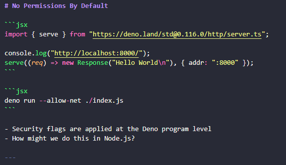

# Deno: TypeScript & JavaScript Runtime


---
# Summary
- What is Deno
- Why does Deno exist
- Deno’s key features
- Key differences between Node and Deno
- MARP

---

# What
- TypeScript/JavaScript runtime
- Built around the V8 engine
- Made by Ryan Dahl


---

# Why
- Security Concerns
- Distancing from 
- Standardisation of package.json
- node_modules

---

# Key Features

- Opt-in Permissions System
- TypeScript First
- No Redundent Third Party Code
- Maintaining Browser Semantics

---

# Opt-in Permission System
- When running anything in Deno permission flags need to be passed in to determine what Deno is allowed to do, this includes accessing the network or disk drive.

```jsx
—allow-env —allow-run 
—allow-net —allow-hrtime
—allow-read —allow-write
—allow-all
```

---

# Opt-in Permission System

```jsx
import { serve } from "https://deno.land/std@0.116.0/http/server.ts";

console.log("http://localhost:8000/");
serve((req) => new Response("Hello World\n"), { addr: ":8000" });
```

```jsx
deno run --allow-net ./index.js
```

- Security flags are applied at the Deno program level
- How might we do this in Node.js?

---

# TypeScript First

- Deno is built as a typescript forward runtime
- How does it work?

---

# No More Package.json? Sort of?

- Fear of privately controlled central repositories
- Package.json & package-lock.json
- Does this solve the main issues with npm and third party code?

---

# Just the One Node_Modules Actually

- All imports are stored globally instead of within each project
- Great for local development, benefits are reduced for deployed applications

---

# Maintaining Browser Semantics

- Deno opts to use ESModules format for importing and exporting code
- Whats the difference between CommonJS and ESModules?

---

# Does Deno Meet It's Original Requirements

- Security Concern Regarding File / Network Access
- Removal of package.json
- No longer relying on a central repository for third party modules
- Removing duplicate packages by using a global cache
- Maintain browser semantics where possible

---

# MARP

- Compiles markdown into pdf / pptx files
- Define presentation themes using CSS
- Easy to use with version control


---

# Questions

